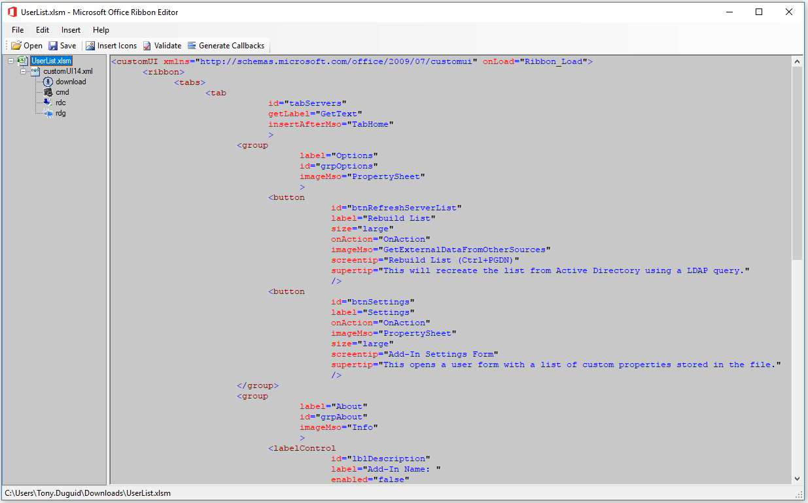

Office Custom UI Editor
===============

This GitHub repo contains the latest version of the the Office Custom UI Editor application and all its source code.
The Office Custom UI Editor is a standalone tool to edit the Custom UI part of Office open document file format. 
It contains both Office 2007 and Office 2010 custom UI schemas. 

The Office 2010 custom UI schema is the latest schema and it's still being used in the latest versions of Office including Office 2013, Office 2016 and Office 365. 

 

<h1 align="left">
  
</h1>

 
 

To learn more about how to use these identifiers to customize the Office ribbon, backstage, and context menus visit:
 - [Customizing the Office Fluent Ribbon for Developers](https://msdn.microsoft.com/en-us/library/aa338202(v=office.14).aspx)
 - [Introduction to the Office Backstage View for Developers](https://msdn.microsoft.com/en-us/library/ee691833(office.14).aspx)
 - [Office Fluent User Interface Control Identifiers](https://github.com/OfficeDev/office-fluent-ui-command-identifiers)
